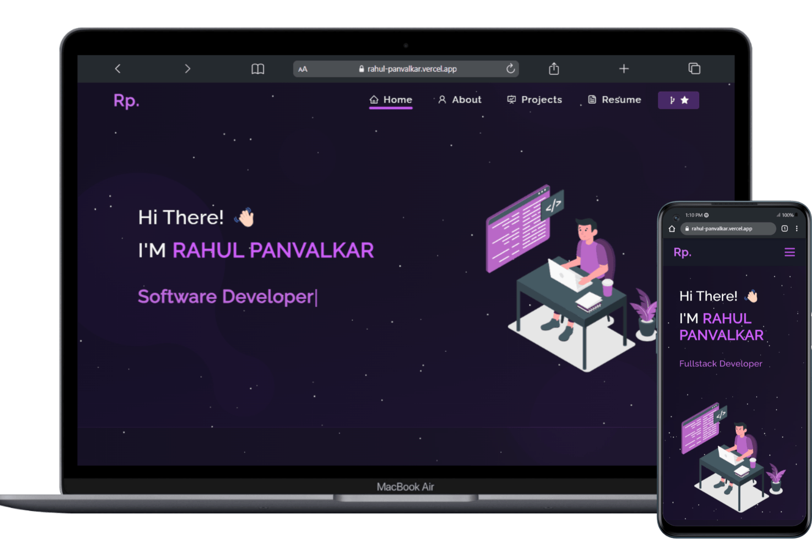

<h1 align="center">
  Portfolio Website 
  <a href="https://rahul-panvalkar.vercel.app/" target="_blank">rahul.tech</a>
</h1>

  

 

 &nbsp;
 &nbsp;

## About

My personal portfolio, which features some of my github projects as well as my resume and technical skills.

## TL;DR

This project is inspired by the design in [Soumyajit4419's Portfolio](https://github.com/soumyajit4419/Portfolio), originally built using React, which I have adapted to Angular.

Feel free to fork or modify the project, but please give credit to both the original author and me for the design and adaptation:

- Original Design by [Soumyajit4419](https://github.com/soumyajit4419/Portfolio)
- Adapted by [RahulPanvalkar](https://github.com/RahulPanvalkar/Portfolio)

## Built

Build Using: 
- `Angular` (16.2.0)
- `Node` (18.20.5) and `npm` (8.0.0)
- `Bootstrap` (5.3.3)
- `HTML5` and `CSS3`
- `RxJS`
- `Font Awesome`
- [`GitHub Contributions API`](https://github.com/grubersjoe/github-contributions-api)

## Features

**📖 Multi-Page Layout**

**🎨 Styled with Bootstrap and CSS with easy to customize colors**

**📱 Fully Responsive**

**☁️ Resume stored on Cloudinary** — Automatically updates without updating repo.

**💾 IndexedDB** — Caches PDF and GitHub contribution data to improve responsiveness and reduce unnecessary API calls.

## Getting Started
Clone this repository. You will need `Node.js` and `Git` installed globally on your machine.

### 🛠 Installation and Setup Instructions
1. Install dependencies:
Run `npm install` to install all required dependencies.

2. Run the project:
In the project directory, run:
`ng serve`
This will start the app in development mode.\
Open [http://localhost:4200](http://localhost:4200) to view it in your browser.
The page will automatically reload if you make edits.

### Usage Instructions
Navigate to the components:
Open the project folder and navigate to `/src/app/components/`. 
You'll find all the components used in the app and you can edit your information accordingly.

### Show your support

Give a ⭐ if you like this website!